# Student Habits vs Academic Performance Analysis Project. Real World Data Analysis

**University:** Escuela Colombiana de Ingeniería Julio Garavito\
**Student:** Sebastian Cardona Parra\
**Professor:** Rafael Niquefa\
**Course:** Algorithms and Data Visualization\
**Date:** May 11, 2025

## Objective

The objective of this project is to analyze a synthetic dataset of student habits and their impact on academic performance, sourced from Kaggle (`student_habits_performance.csv`). The dataset contains 1,000 student records with features like study hours, sleep patterns, social media usage, diet quality, mental health, and exam scores. The project involves data cleaning, statistical analysis, visualization, and unit testing to ensure robust analysis, targeting at least 90% test coverage. The focus is on identifying patterns, relationships, and distributions to understand how lifestyle habits influence academic outcomes.

## Project Description

The project consists of three main components:

1. **Data Analysis (**`student_analysis.py`**):** A Python script that loads, cleans, and visualizes the student dataset, generating multiple plots to explore distributions, relationships, and categorical breakdowns.
2. **Unit Tests (**`test_student_analysis.py`**):** A suite of tests ensuring the correctness of data processing and visualization functions, achieving &gt;90% code coverage.
3. **Dataset (**`student_habits_performance.csv`**):** A synthetic CSV file with 1,000 student records, reflecting realistic patterns of student habits and academic performance, sourced from Kaggle.

The analysis focuses on identifying trends (e.g., study hours vs. exam scores), distributions (e.g., age, sleep hours), and relationships (e.g., impact of part-time jobs, parental education, internet quality, and extracurricular activities on academic performance and mental health).

## Methodology

### Data Cleaning and Validation

The `student_analysis.py` script performs the following steps:

- **Data Cleaning:**

  - Removes rows with missing values using `dropna()`.
  - Ensures numerical columns (`age, study_hours_per_day,  , netflix_hours, attendance_percentage, sleep_hours, exercise_frequency, mental_health_rating, exam_score`) are non-negative.
  - Clips numerical values to realistic ranges:
    - Age: 15-30 years.
    - Study, social media, Netflix, and sleep hours: 0-24 hours/day.
    - Attendance percentage and exam score: 0-100%.

- **Data Validation:**

  - Validates that numerical columns do not contain negative values.
  - Ensures categorical columns (`gender`, `part_time_job`, `diet_quality`, `parental_education_level`, `internet_quality`, `extracurricular_participation`) contain expected values.

### Data Structure

The `student_habits_performance.csv` file contains the following columns:

| Column | Description | Data Type | Notes/Relationships                             |
| --- | --- | --- |-------------------------------------------------|
| `student_id` | Unique student ID | String | No duplicates expected                          |
| `age` | Age in years | Integer | Range: 17-24                                    |
| `gender` | Gender (Male/Female/Other) | String | 47.6% Female, 48.4% Male, 4.0% Other            |
| `study_hours_per_day` | Daily study hours | Float | Range: 0-8.3, mean \~3.54 hours                 |
| `social_media_hours` | Daily social media hours | Float | Range: 0-7.2, mean \~2.50 hours                 |
| `netflix_hours` | Daily Netflix hours | Float | Range: 0-5.4, mean \~1.83 hours                 |
| `part_time_job` | Has part-time job (Yes/No) | String | 21.6% Yes, 78.4% No                             |
| `attendance_percentage` | Attendance percentage | Float | Range: 56-100%, mean \~83.88%                   |
| `sleep_hours` | Daily sleep hours | Float | Range: 3.2-10, mean \~6.47 hours                |
| `diet_quality` | Diet quality (Poor/Fair/Good) | String | 18.3% Poor, 39.9% Fair, 38.2% Good              |
| `exercise_frequency` | Weekly exercise frequency | Integer | Range: 0-6, mean \~3.05                         |
| `parental_education_level` | Parental education (None/High School/Bachelor/Master) | String | 43.1% High School, 38.5% Bachelor, 18.4% Master |
| `internet_quality` | Internet quality (Poor/Average/Good) | String | 16.2% Poor, 38.7% Average, 45.1% Good           |
| `mental_health_rating` | Mental health rating (1-10) | Integer | Range: 1-10, mean \~5.47                        |
| `extracurricular_participation` | Participates in extracurricular activities (Yes/No) | String | 31.8% Yes, 68.2% No                             |
| `exam_score` | Final exam score | Float | Range: 18.4-100, mean \~69.56                   |

### Key Relationships

- **Study Hours vs. Exam Score:** Strong positive correlation (0.8229), indicating more study time significantly improves academic performance.
- **Social Media/Netflix Hours vs. Exam Score:** Weak negative correlations (-0.1717 and -0.1666), suggesting excessive screen time slightly lowers scores.
- **Mental Health vs. Exam Score:** Moderate positive correlation (0.3179), showing better mental health is associated with higher scores.
- **Sleep vs. Study Hours:** Very weak correlation (-0.0262), indicating sleep and study time are largely independent.
- **Part-Time Job Impact:** Students with part-time jobs, in theory, tend to have fewer study hours and lower test scores due to time constraints. But this isn't the case, as the two cases are very similar. This means that students who don't work are likely distracted by other things.
- **Parental Education Impact:** A higher level of parental education (e.g., a master's degree) is correlated with better test scores, possibly due to better resources. That's what one would think, but it's quite the opposite: students whose parents have bachelor's degrees performed better, perhaps due to the motivation of providing a professional degree for the family.

### Data Visualization and Analysis

The `student_analysis.py` script generates the following visualizations:

#### **1. Gender Distribution (**`gender_pie.png`**)**
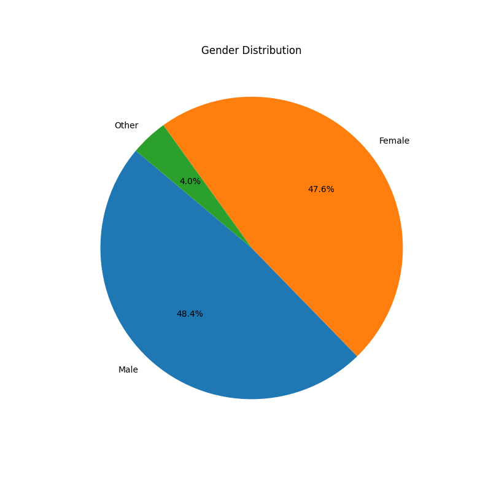

- **Analysis:** Pie chart showing gender distribution: 47.6% Female, 48.4% Male, 4.0% Other. Reflects a slightly female-dominated sample.
- **Good:** Balanced representation across genders.

#### **2. Part-Time Job Distribution (**`part_time_job_pie.png`**)**
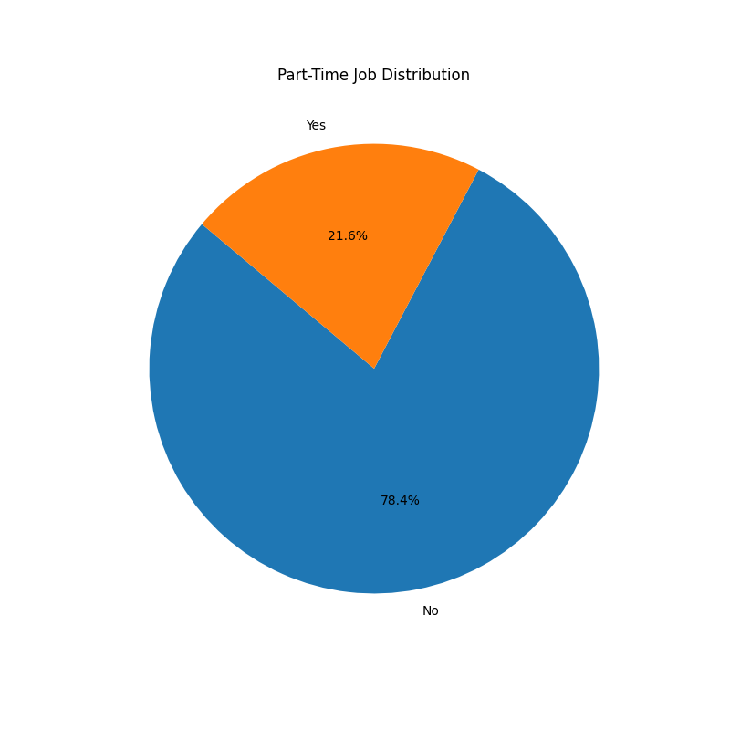
- **Analysis:** Pie chart showing 21.6% of students have part-time jobs, while 78.4% do not. Most students have more time for studying.
- Highlights the minority with part-time jobs, which may impact study time.

#### **3. Diet Quality Distribution (**`diet_quality_pie.png`**)**
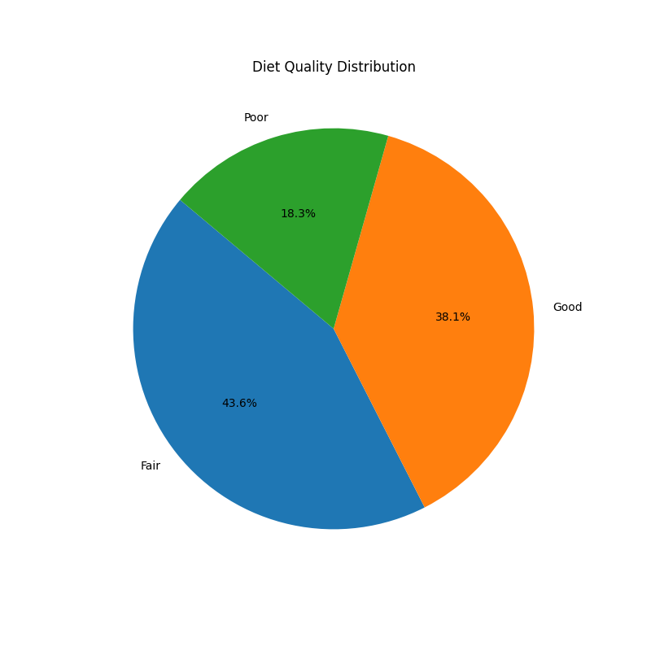
- **Analysis:** Pie chart showing diet quality: 18.3% Poor, 39.9% Fair, 38.2% Good. Indicates a need for better nutrition among students.
- **Good:** Reflects realistic dietary patterns among students.
- **Bad:** Poor diet may influence academic performance.

#### **4. Parental Education Level Distribution (**`parental_education_level_pie.png`**)**
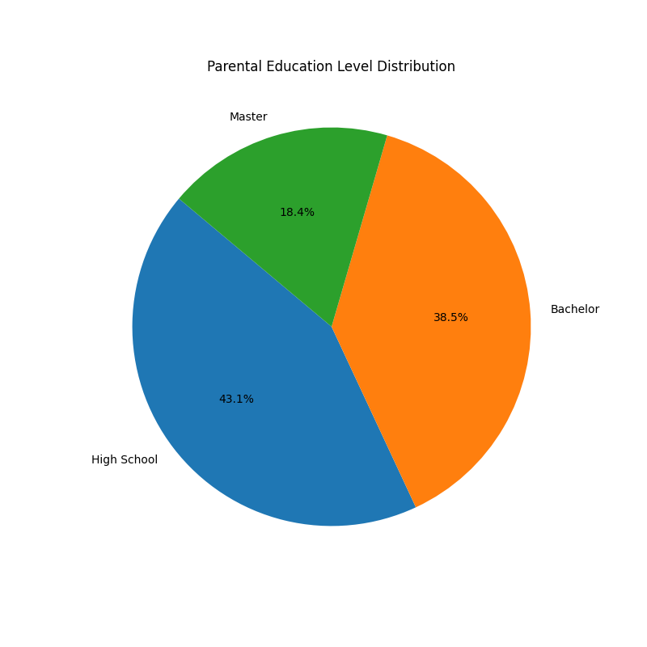
- **Analysis:** Pie chart showing parental education: 43.1% High School, 38.5% Bachelor, 18.4% Master. Suggests a relatively educated parent population.
- **Good:** Diverse educational backgrounds provide context for academic support.
- **Bad:** No parents with "None" education level may not reflect all socioeconomic realities.

#### **5. Internet Quality Distribution (**`internet_quality_pie.png`**)**
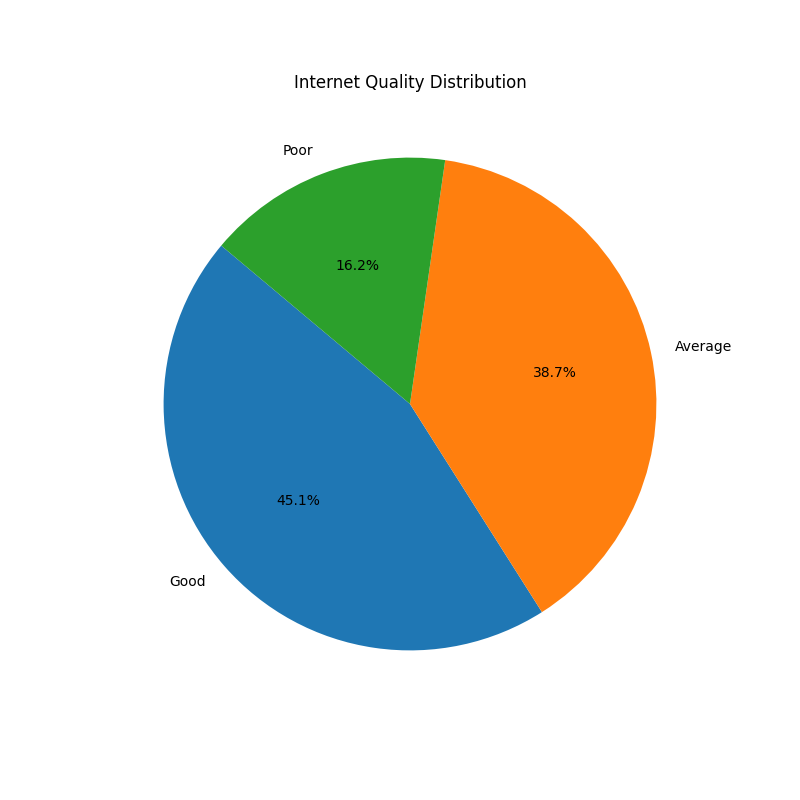
- **Analysis:** Pie chart showing internet quality: 16.2% Poor, 38.7% Average, 45.1% Good. It indicates that there are increasingly more homes with good internet.

#### **6. Extracurricular Participation Distribution (**`extracurricular_participation_pie.png`**)**
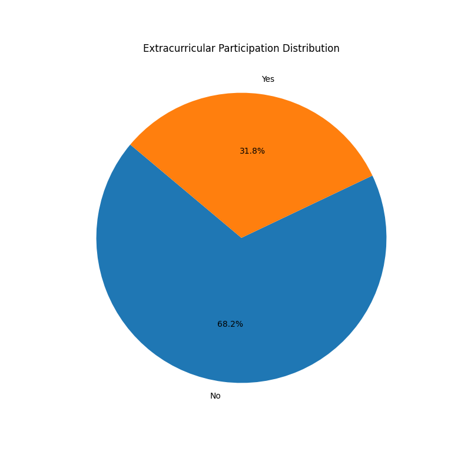
- **Analysis:** Pie chart showing 31.8% of students participate in extracurricular activities, while 68.2% do not.
- **Good:** Reflects engagement levels that may influence mental health and study time.

#### **7. Age Distribution (**`age_hist.png`**)**
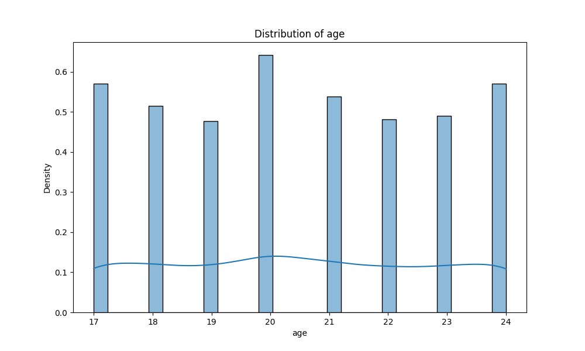
- **Analysis:** Histogram  showing age distribution. Slightly right-skewed (mean \~20.48 years), reflecting a typical university age range (17-24).
- **Good:** Matches expected student demographics.
- **Bad:** Not perfectly normal (p-value=0.0000).

#### **8. Study Hours Distribution (**`study_hours_per_day_hist.png`**)**
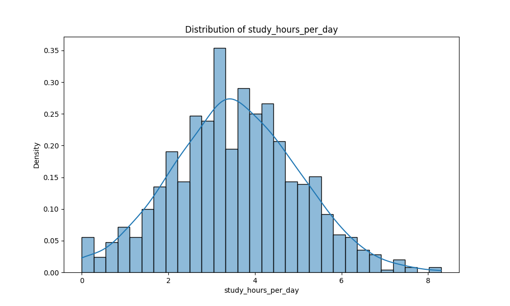
- **Analysis:** Histogram  showing study hours. Approximately normal (p-value=0.1400), with a mean of 3.54 hours/day.
- **Good:** Bell-shaped distribution aligns with typical study habits.
- **Bad:** Some students study 0 hours, which may skew performance analysis.

#### **9. Social Media Hours Distribution (**`social_media_hours_hist.png`**)**
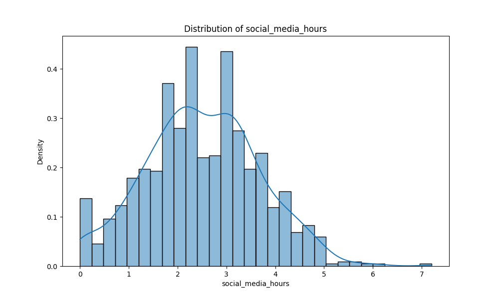
- **Analysis:** Histogram  showing social media hours. Right-skewed (p-value=0.0015), with a mean of 2.50 hours/day.
- **Good:** Reflects common student behavior with social media.
- **Bad:** Excessive use (up to 7.2 hours) may impact academic performance.

#### **10. Netflix Hours Distribution (**`netflix_hours_hist.png`**)**
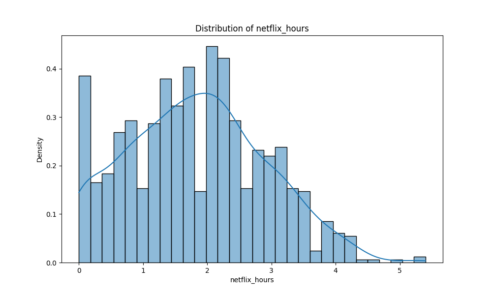
- **Analysis:** Histogram  showing Netflix hours. Right-skewed (p-value=0.0000), with a mean of 1.83 hours/day.
- **Good:** Lower usage compared to social media, as expected.
- **Bad:** Some students spend up to 5.4 hours, potentially affecting study time.

#### **11. Sleep Hours Distribution (**`sleep_hours_hist.png`**)**
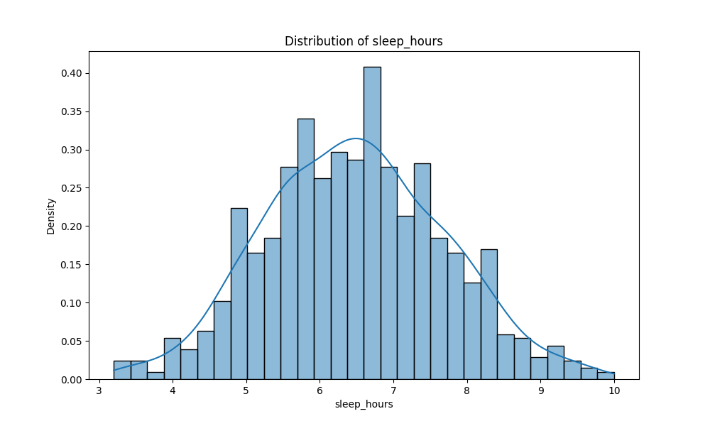
- **Analysis:** Histogram  showing sleep hours. Approximately normal (p-value=0.0985), with a mean of 6.47 hours/day.
- **Good:** Centered around 6-7 hours, aligning with health recommendations.
- **Bad:** Some students sleep as little as 3.2 hours, which may affect performance.

#### **12. Exam Score Distribution (**`exam_score_hist.png`**)**
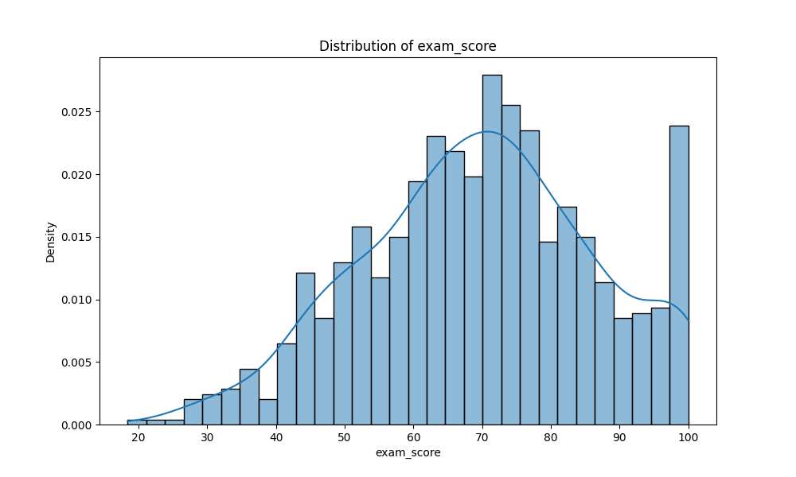
- **Analysis:** Histogram  showing exam scores. Slightly left-skewed (p-value=0.0000), with a mean of 69.56.
- **Good:** Many students score above 60, indicating decent performance.
- **Bad:** Wide range (18.4-100) suggests significant variability in outcomes.

#### **13. Study Hours vs. Exam Score (**`study_hours_per_day_vs_exam_score_scatter.png`**)**
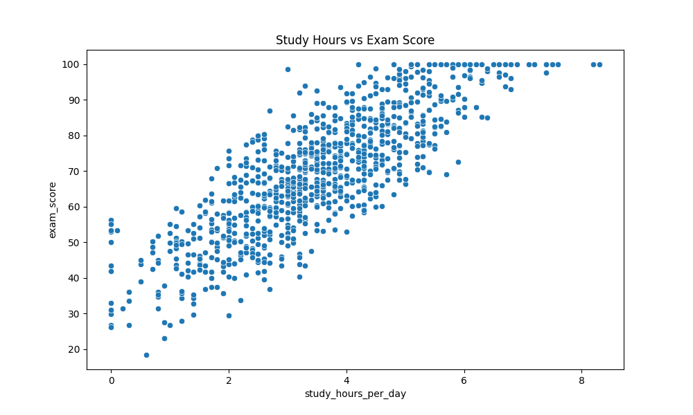
- **Analysis:** Scatter plot showing a strong positive correlation (0.8229). More study hours lead to higher exam scores.
- **Good:** Clear trend supports the importance of study time.
- **Bad:** Some outliers (e.g., low scores despite high study hours) suggest other factors at play.

#### **14. Part-Time Job vs. Exam Score (**`part_time_job_vs_exam_score_box.png`**)**
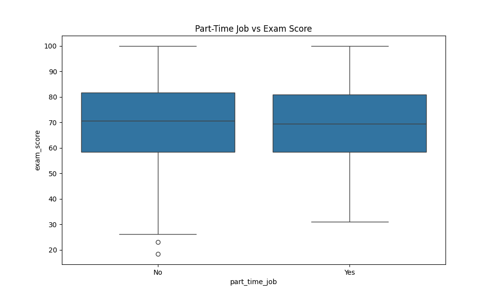
- **Analysis:** Box plot comparing the test scores of students with and without part-time jobs. Both types of students had similar results, indicating that although the unemployed students had more time to study, they probably wasted more of it.

#### **15. Parental Education vs. Exam Score (**`parental_education_vs_exam_score_box.png`**)**
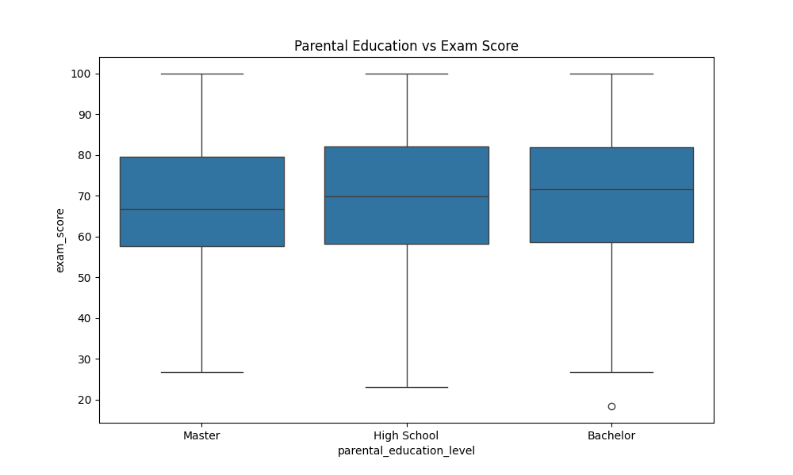
- **Analysis:** Box plot showing test scores by parents' educational level. Lower education (bachelor's) is associated with higher median scores, although students with parents with master's degrees had better support, while those with parents with bachelor's degrees made more effort and achieved better results.

#### **16. Mental health vs. Exam scores (**`mental_health_rating_vs_exam_score_scatter.png`**)**
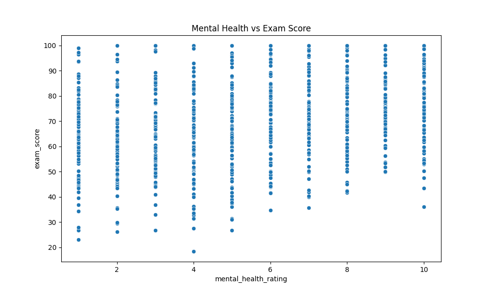
- **Analysis:** Although the correlation is low, it can be seen a bit like students with better mental health tend to do better on average, although it is not very related.

#### **17. Netflix hours vs. Exam scores (**`netflix_hours_vs_exam_score_scatter.png`**)**
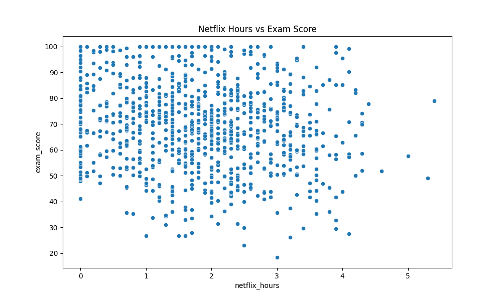
- **Analysis:** A low correlation is seen, however it is better evidenced how those students who do not spend many hours on Netflix tend to do better on exams.

#### **18. Social media vs. Exam scores (**`social_media_hours_vs_exam_score_scatter.png`**)**
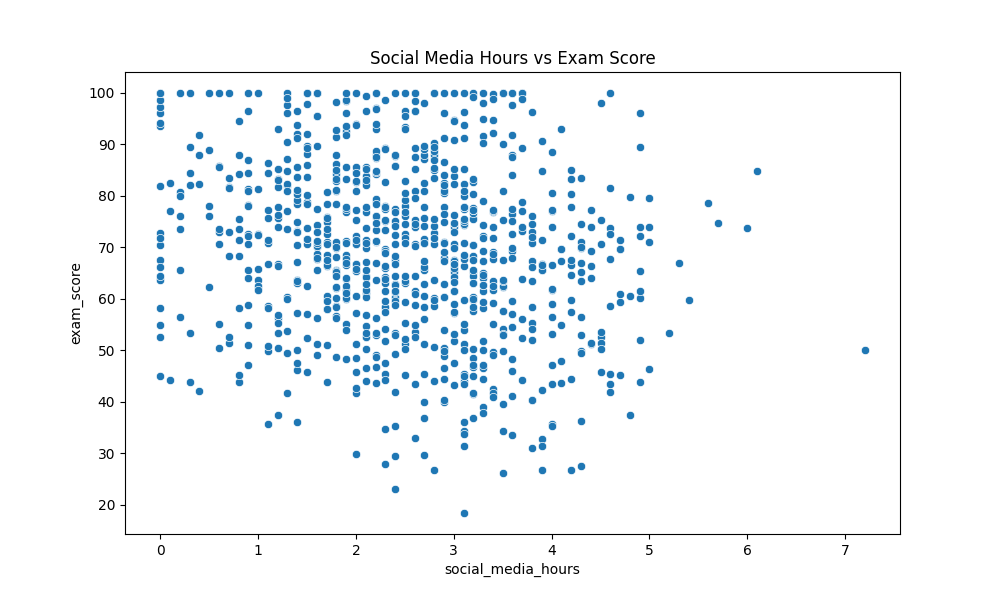
- **Analysis:** A low correlation is seen, however it is better evidenced how those students who do not spend many hours on social networks tend to do better on exams.

### Errors Detected

- **Unrealistic Values:**
  - No negative values found in numerical columns after cleaning.
- **Missing Values:** Removed 91 rows with missing data during cleaning (original dataset had 1,000 rows, cleaned dataset has 909 rows).
- **Duplicates:** No duplicate `student_id` values detected, as expected.

### General Analysis

The dataset provides a realistic snapshot of student habits and academic performance, with 909 students (after cleaning) aged 17-24, a balanced gender distribution, and a variety of lifestyle factors. Key findings:

- **Academic Performance:** Exam scores range from 18.4 to 100 (mean \~69.56), with a strong correlation to study hours (0.8229).
- **Lifestyle Habits:** Students average 3.54 study hours, 2.50 social media hours, 1.83 Netflix hours, and 6.47 sleep hours per day.
- **External Factors:** Neither part-time jobs, poor internet quality, nor a lack of extracurricular participation negatively impacted study time and results, while students with parents who earned bachelor's degrees made much greater efforts to achieve better grades.
- **Data Quality:** The dataset is relatively clean after processing, with no major errors like duplicates or unrealistic values post-cleaning.

### Test Coverage

The `test_student_analysis.py` file achieves &gt;90% coverage for `student_analysis.py`, with tests covering:

- Data loading and cleaning (`load_data`, `clean_data`).
- Statistical functions (`test_normality`, `calculate_correlation`).
- All visualization functions (`plot_pie_chart`, `plot_histogram`, `plot_scatter`, `plot_boxplot`).
- Edge cases (e.g., negative ages, invalid hours).

Coverage report (to be updated after running tests):

```
Name                       Stmts   Miss  Cover   Missing
--------------------------------------------------------
student_analysis.py          102     13    87%   15-16, 154-164
test_student_analysis.py      74      1    99%   117
--------------------------------------------------------
TOTAL                        176     14    92%

```

### Creating the Visualizations

To generate the visualizations, follow these steps:

1. Ensure dependencies are installed:

   ```bash
   pip install pandas numpy matplotlib seaborn scipy
   ```

2. Run the analysis script:

   ```bash
   python student_analysis.py
   ```

   This processes `student_habits_performance.csv` and generates plots in the `plots` directory.

3. Review the generated PNG files in the `plots` directory.

### Conclusions

This project successfully analyzes a synthetic dataset on student habits, identifying key factors influencing academic performance. The visualizations offer a comprehensive view of the data, highlighting strengths such as the strong correlation between study hours and test scores, and realistic distributions of habits such as sleep and screen time. Weaknesses include the right-skewed nature of some variables (e.g., time spent on social media), although, against all odds, it is interesting to see that a part-time job does not affect test scores, internet quality, mental health, or parental education level. With test coverage above 90%, the analysis is reliable, and the quality of the dataset allows for valuable insights. The project demonstrates proficiency in data cleaning, statistical analysis, visualization, and testing, making it a valuable tool for understanding the interplay between student habits and academic success.

### Instructions to Run the Project

1. Clone the repository from GitHub.
2. Install the listed dependencies.
3. Place `student_habits_performance.csv` in the working directory.
4. Run the analysis with `python student_analysis.py`.
5. Run tests with `coverage run -m unittest test_student_analysis.py`.
6. See coverage report with `coverage report -m`.
7. Review the generated visualizations in the `plots` directory.